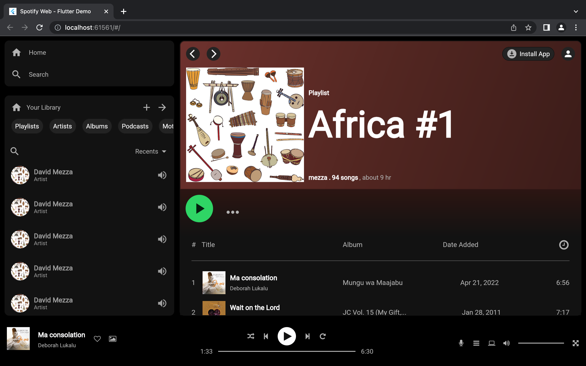

# Spotify Web App Clone with Flutter

This is a clone of the Spotify web app built using Flutter. The app replicates the core features and design of the original Spotify web app, allowing users to browse and listen to their favorite music.

## Features

- User authentication: Users can create accounts or log in using their existing Spotify credentials.
- Home page: Displays a personalized feed of recommended songs, playlists, and artists based on the user's listening history and preferences.
- Search functionality: Users can search for songs, artists, and albums and view detailed information about them.
- Playlists: Users can create and manage playlists, add or remove songs, and play their playlists.
- Player controls: Provides controls to play, pause, skip, and adjust the volume of the currently playing song.
- Discover section: Allows users to explore new music, popular playlists, and trending artists.
- User profile: Displays user information, including their profile picture and recently played songs.

## Screenshot

